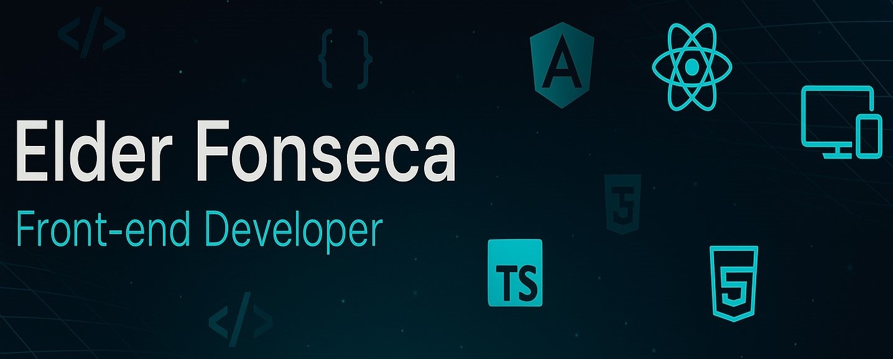

# Elder Fonseca | Front-end Developer Portfolio



## 💼 About The Project

This is a professional portfolio developed with Vue.js 3 and Vite, showcasing my experience as a Full-Stack Developer, projects, skills, and contact information.

The website is fully responsive, features interactive animations, supports multiple languages (Portuguese and English), and was built following modern web development best practices.

🌐 **[View Demo](https://elderfonseca.dev)** _(coming soon)_

## ✨ Features

- 🎨 Modern design with dark theme
- 📱 Fully responsive layout
- 🌍 Multiple language support (PT-BR and EN)
- 🔄 Interactive animations with anime.js
- 🌐 Interactive 3D globe using Three.js
- 📊 Animated skill visualizations
- 📝 Contact form
- ♿ Enhanced accessibility features
- 🔍 SEO optimized

## 🛠️ Technologies

<p>
  <a href="https://vuejs.org/" target="_blank"></a>
  <a href="https://vite.dev/" target="_blank"></a>
  <a href="https://tailwindcss.com/" target="_blank"></a>
  <a href="https://threejs.org/" target="_blank"></a>
  <a href="https://animejs.com/" target="_blank"></a>
  <a href="https://vue-i18n.intlify.dev/" target="_blank"></a>
</p>

## 🚀 Installation and Usage

### Prerequisites

- Node.js (v16+)
- npm or yarn

### Installation

```bash
# Clone the repository
git clone https://github.com/elderfonseca/portfolio.git

# Enter the directory
cd portfolio

# Install dependencies
npm install
# or
yarn install

# Start the development server
npm run dev
# or
yarn dev
```

The site will be available at `http://localhost:5173`

### Production

```bash
# Build for production
npm run build
# or
yarn build

# Preview the production build
npm run preview
# or
yarn preview
```

## 📁 Project Structure

```
src/
├── assets/             # Static assets (images, styles)
├── components/         # Reusable Vue components
│   ├── common/         # Generic components (Button, NavLink, etc.)
│   ├── layout/         # Layout components (Header, Footer, etc.)
│   └── sections/       # Main site sections
├── composables/        # Vue composables (reusable logic)
├── config/             # Configurations and constants
├── locales/            # Translation files (i18n)
├── plugins/            # Vue plugins (i18n, animations, etc.)
├── services/           # Services and APIs
├── utils/              # Utility functions
├── App.vue             # Main component
└── main.js             # Entry point
```

## 📝 Code Features

### Components

- `AnimatedName`: SVG name animation with drawing effect
- `Button`: Reusable button component with various variants
- `LanguageSwitcher`: Language toggle with interactive 3D globe
- `ProjectCard`: Card for project display
- `TimelineItem`: Timeline item for work experience

### Composables

- `useAnimations`: Manages animations based on anime.js
- `useGlobe`: Controls the 3D globe using Three.js
- `useLocale`: Manages language configuration

### Utilities

- `accessibilityUtils`: Functions to enhance accessibility

## 🌐 Internationalization

The site supports Portuguese and English, with the ability to expand to other languages.

To add a new language:

1. Create a new file in the `src/locales/` folder
2. Add the language to the `AVAILABLE_LANGUAGES` constant in `src/config/constants.js`

## 🎨 Customization

### Colors

The main theme colors can be adjusted in `src/config/colors.js`:

```javascript
const colors = {
  primary: {
    dark: '#00ADB5',
    light: '#00FFF5',
  },
  background: {
    primary: '#222831',
    secondary: '#393E46',
  },
  text: {
    primary: '#FFFFFF',
    secondary: '#CCCCCC',
    accent: '#00FFF5',
  },
  // ...
};
```

### Content

Most content can be edited through the language files in `src/locales/`.

## 🔧 Available Scripts

- `npm run dev` - Start the development server
- `npm run build` - Build the site for production
- `npm run preview` - Preview the production build locally

## 📄 License

[MIT](LICENSE)

## 📞 Contact

Elder Fonseca - [elder.fonseca15@gmail.com](mailto:elder.fonseca15@gmail.com)

- LinkedIn: [linkedin.com/in/elder-fonseca-lima](https://www.linkedin.com/in/elder-fonseca-lima)
- GitHub: [github.com/elderfonseca](https://github.com/elderfonseca)

---

Developed with ❤️ by Elder Fonseca
